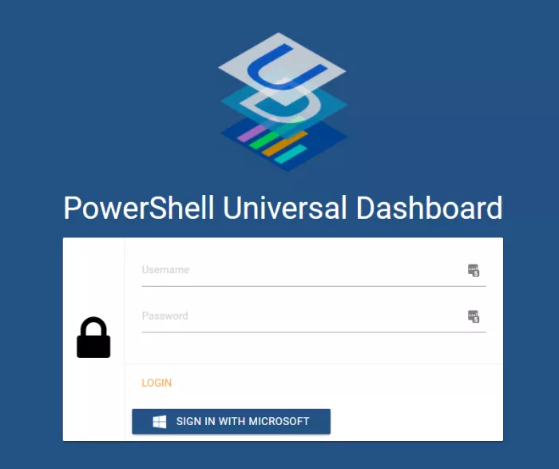

# Login Pages

Login pages allow you to create dashboards that require authentication to access. You can define your own authentication endpoint to perform the authentication yourself or use a third party OAuth provider to do so. To create your login page, you can use the New-UDLoginPage and LoginPage parameter of New-UDDashboard.

```text
$Dashboard = New-UDDashboard -LoginPage $LoginPage -Page @(
    $MyDashboardPage
)
```



## Customizing a Login Page

There are several aspects of the login page you can customize to meet your branding and color preferences.

* Logo - Use New-UDImage to specify the logo you wish to show above the login dialog. 
* PageBackgroundColor - The background color of the page. This can be any hex color. 
* LoginFormBackgroundColor - The background color of the login form. This can be any hex color. 
* LoginFormFontColor - The font color of the login form. This can be any hex color. 

## Forms Authentication

Forms authentication is accomplished using the New-UDAuthenticationMethod cmdlet paired with the AuthenticationMethod parameter of the New-UDLoginPage cmdlet. Use the Endpoint parameter of New-UDAuthenticationMethod to specify an endpoint to be executed when a user attempts to login to the dashboard. The param block of the Endpoint script block show contain a $Credential parameter to accept the credentials of the user.

You can then authenticate the user however you want. This could be using something like Active Directory or another method via PowerShell.

To return an authentication result to the user, use New-UDAuthenticationResult. The Success switch parameter specifies that the authentication was a success. If you want to use a custom error message, you can use the ErrorMessage parameter. You should pass the user's user name to the UserName parameter during a successful authentication.

```text
$FormLogin = New-UDAuthenticationMethod -Endpoint {
    param([PSCredential]$Credentials)

    if ($Credentials.UserName -eq "Adam" -and $Credentials.GetNetworkCredential().Password -eq "SuperSecretPassword") {
        New-UDAuthenticationResult -Success -UserName "Adam"
    }

    New-UDAuthenticationResult -ErrorMessage "You aren't Adam!!!"
}
```

## OAuth Authentication

Universal Dashboard supports logging in with four OAuth providers. These include Facebook, Microsoft, Google and Twitter. You can use the New-UDAuthenticationMethod cmdlet to specify an OAuth provider. You need to specify the Application ID and Secret that received from the provider to support authentication. These may also be called terms like Client ID and Secret but all are pretty much a user name and password to your application. To register for a application ID and secret for one of the providers, follow the documentation in any of the links below.

* [Facebook](https://docs.microsoft.com/en-us/aspnet/core/security/authentication/social/facebook-logins?tabs=aspnetcore2x)
* [Twitter](https://docs.microsoft.com/en-us/aspnet/core/security/authentication/social/twitter-logins?tabs=aspnetcore2x)
* [Google](https://docs.microsoft.com/en-us/aspnet/core/security/authentication/social/google-logins?tabs=aspnetcore2x)
* [Microsoft](https://docs.microsoft.com/en-us/aspnet/core/security/authentication/social/microsoft-logins?tabs=aspnetcore2x)

While registering for your application ID, you will need to specify a callback URL for the service to call after completing authentication. This URL should be of the following format.

> http\(s\)://hostname:port/signin-provider

For example, if I had a dashboard on webserver12, listening on port 1200 running HTTPS and I wanted to sign in with Google, my callback URL would be:

> [https://webserver12:1200/signin-google](https://webserver12:1200/signin-google)

You can also use localhost if you want to test it out.

Once you have registered your application, you can pass the ID and secret to New-UDAuthenticationMethod as well as the provider type.

```text
$MicrosoftLogin = New-UDAuthenticationMethod -AppId "1111111-11111-11111-1111-1111111111" -AppSecret "xxxxxxxxxxxxxxx" -Provider Microsoft
```

## Accessing the User name in a Dashboard

In any Endpoint script block, you can access the user name. This means that Charts, Dynamic Pages, Tables and other controls can access the $User variable to get the current logged in user name.

