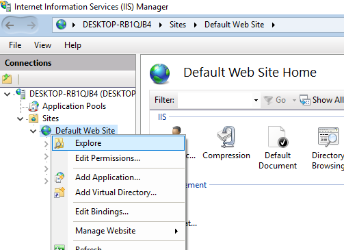
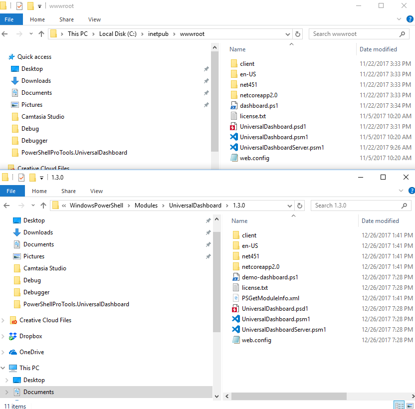
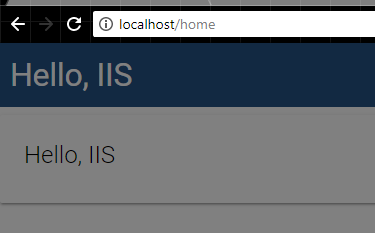
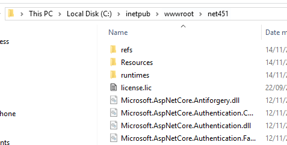

# IIS

To run a dashboard in IIS, you will need to configure an application pool and website just as you would with any other IIS web application. IIS requires that the [ASP.NET Core Installer](https://www.microsoft.com/net/download/windows) is installed to run Universal Dashboard. Once installed, you will have to configure your website for Universal Dashboard.

## Configuring a site for Universal Dashboard

For this example we will look at the Default Web Site. In IIS Manager, right click on your Web Site and click Explore.



Copy the entire contents of the UniversalDashboard module to the wwwroot of the Default Web Site.



Create a `dashboard.ps1` file and place it in the `wwwroot` folder. The dashboard should contain a dashboard definition and a call to `Start-UDDashboard` with the `-Wait` parameter specified.

```text
 Start-UDDashboard -Wait -Dashboard (
    New-UDDashboard -Title "Hello, IIS" -Content {
        New-UDCard -Title "Hello, IIS"
    }
)
```

Navigate to the IIS website in your browser and you should see Universal Dashboard running.



## Licensing

The license should be named license.lic and placed in the `net451` folder within `wwwroot`. This will ensure that the license is persistent throughout restarts.



